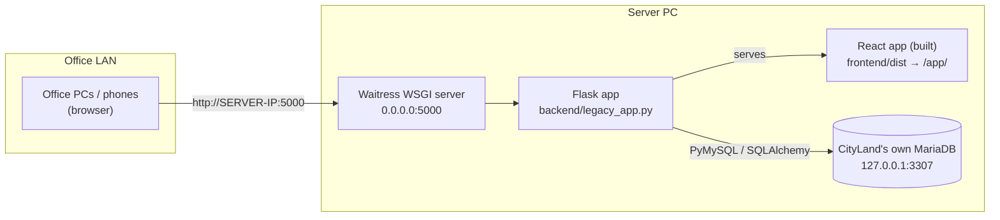
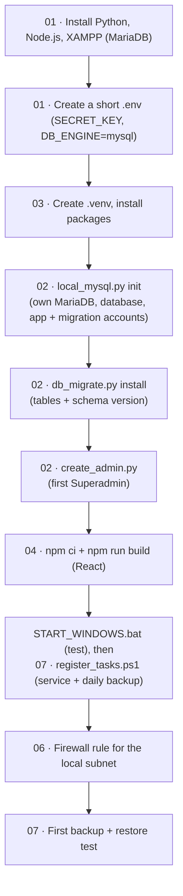

# CityLand 9 Condo Management System — Run Guide

How to install, start, stop and troubleshoot the system on the office server PC and on a
developer PC. Everything runs **locally on the office network (LAN)**; no cloud service is used.

| Guide | Covers |
|---|---|
| [01 — Prerequisites & `.env`](01-PREREQUISITES_AND_ENV.md) | Software to install, the `.env` configuration file |
| [02 — Database setup](02-DATABASE_SETUP.md) | CityLand's own MariaDB, tables, first admin account, backups, schema changes |
| [03 — Backend setup](03-BACKEND_SETUP.md) | Python environment, starting Flask/Waitress on the LAN |
| [04 — Frontend setup](04-FRONTEND_SETUP.md) | Node.js, building the React app, development and prototype modes |
| [05 — Troubleshooting](05-TROUBLESHOOTING.md) | Port conflicts, firewall, database errors, "CORS", blank pages |
| [06 — Security](06-SECURITY.md) | Required settings, passwords and accounts, HTTPS on the LAN, firewall |
| [07 — Operations](07-OPERATIONS.md) | Windows service, automatic backups, restore, monitoring, upgrades |

Scripts in the project root: **`START_WINDOWS.bat`** (start) and **`STOP_WINDOWS.bat`** (stop).
On the server, `scripts\windows\register_tasks.ps1` installs the server and the daily backup as
scheduled tasks ([07](07-OPERATIONS.md)).

---

## 1. Architecture



| Layer | Technology | Where |
|---|---|---|
| Frontend | React 19 + TypeScript + Vite + Tailwind CSS | `frontend/` → built into `frontend/dist`, served by Flask at **`/app/`** |
| Backend | Flask 3.1 on the **Waitress** WSGI server (8 threads) | `backend/` (entry point `backend/run.py`), port **5000** |
| Classic screens | Flask/Jinja pages, still used by staff modules not yet rebuilt | `legacy_flask_ui/`, served at `/` paths (e.g. `/billing`) |
| Database | **MariaDB** (XAMPP binaries) with CityLand's **own data folder and port** | `database/mysql-data/`, **127.0.0.1:3307** (this PC only) |

Key points:

- **One server, one port.** The React app, its API (`/api/...`) and the classic screens are all
  served by the same Flask server on port 5000. The browser never talks to the database.
- **No CORS setup is needed.** The React app and the API are on the same origin. In development,
  Vite forwards `/api` to Flask (see [04](04-FRONTEND_SETUP.md)).
- **The database listens on 127.0.0.1 only**, on port 3307, so it can't be reached from the
  network and doesn't clash with XAMPP's own MySQL on 3306 (which CityLand never touches).
- **Secrets live in the project-root `.env`**, which is excluded from git.

## 2. Setup flow (first installation)



## 3. Quick start

### Production — office server PC (already installed)

```bat
START_WINDOWS.bat
```

- Opens a console window that shows the addresses, for example:
  `This PC: http://127.0.0.1:5000` and `Other PCs: http://192.168.100.63:5000`.
- **Keep the window open** while people use the system.
- **Stop:** press **Ctrl+C** in that window or close it. At the end of the day run
  **`STOP_WINDOWS.bat`** to also stop the database.
- After updating the code (e.g. `git pull`), start with **`START_WINDOWS.bat --rebuild`**
  so the React app is rebuilt.

### Production — brand-new server PC

Follow the flow above: [01](01-PREREQUISITES_AND_ENV.md) → [03 §1–2](03-BACKEND_SETUP.md) (Python
environment) → [02](02-DATABASE_SETUP.md) → [04](04-FRONTEND_SETUP.md), then run `START_WINDOWS.bat`.
With the software already downloaded this takes about 10 minutes.

### Local development

Two terminals, both started in the project root:

```powershell
# Terminal 1 - backend with auto-reload (port 5000)
.venv\Scripts\python.exe backend\run.py

# Terminal 2 - React with hot reload (port 5173), API calls forwarded to port 5000
cd frontend
npm run dev
```

Open **http://127.0.0.1:5173/app/**.

To review the design **without a backend or database** (mock data, Role Switcher):

```powershell
cd frontend
npm run dev:mock
```

Open **http://127.0.0.1:5173/app/** and click any name on the sign-in page.

## 4. Daily checklist (server PC)

- [ ] Run `START_WINDOWS.bat`; the window shows `Database: OK` and the LAN address
- [ ] Open the LAN address from one other PC to confirm the network path
- [ ] Leave the window open during office hours
- [ ] End of day (only when not installed as a service): `STOP_WINDOWS.bat`
- [ ] `http://127.0.0.1:5000/readyz` shows `ready` with no `backup` warning ([07 §4](07-OPERATIONS.md#4-monitoring))

## 5. First sign-in

There is **no default account**. Create the first Superadmin on the server PC with
`.venv\Scripts\python.exe database\create_admin.py` ([02 Step 3](02-DATABASE_SETUP.md#step-3--create-the-first-superadmin)),
then create named accounts for staff under *Users & Access* (Superadmin) and *Resident Accounts*.
Passwords given by an administrator are temporary: each person chooses their own at first sign-in.
