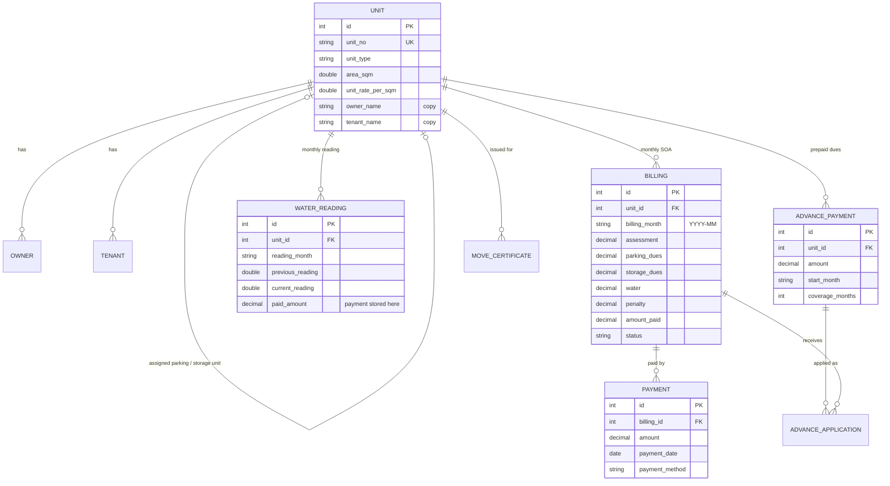
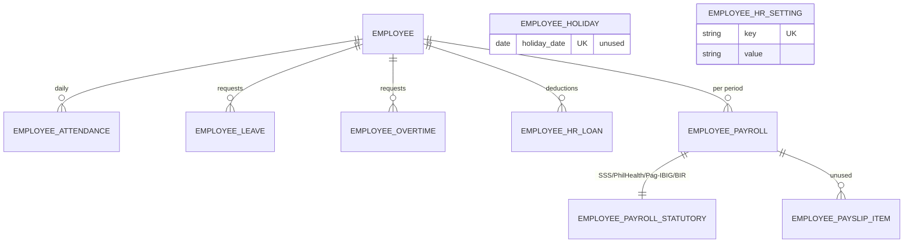
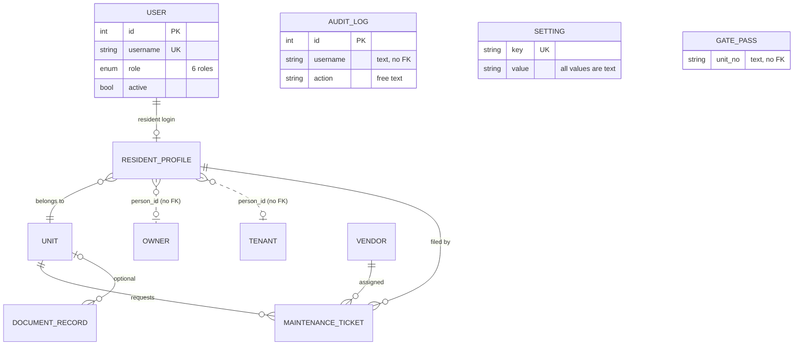

# CityLand 9 — Data Schema Design Review

**Scope:** the 31 tables in `database/schema.sql` (generated from the models in `backend/legacy_app.py`), now running on local MySQL/MariaDB. The full column list is in [migration.md, Appendix A](migration.md#appendix-a--column-reference-generated-from-the-models).
**Date:** 2026-09-30. **Nothing in this document has been changed in the database yet.** Section 4 is a proposal.

---

## 1. Entity-relationship diagrams

### 1.1 Property, billing and payments

### 1.2 HR and payroll

### 1.3 Accounts, residents, community, administration

Tables with no relationships: `announcement`, `expense`, `gate_pass`, `audit_log`, `setting`.

---

## 2. What is good

| Aspect | Why it matters |
|---|---|
| Money columns are `DECIMAL(12,2)` | No floating-point rounding in amounts once on MySQL (SQLite stored them as floats) |
| Foreign keys on almost every relationship (26) | MySQL now **enforces** them, so no more orphan rows |
| Indexes on the busy lookups (bill by unit+month, water by unit+month, payments by bill, attendance by date) | Billing and SOA pages stay fast with hundreds of units |
| Strict role `ENUM`, `utf8mb4_bin`, InnoDB, strict SQL mode | Bad data is rejected instead of silently stored |
| Payroll statutory breakdown is its own 1-to-1 table | Payslips can be reprinted exactly as computed |
| An audit log exists and is written on almost every action | Basic traceability |

---

## 3. Design problems found (evidence from the code)

| # | Severity | Problem | Evidence | Consequence |
|---|---|---|---|---|
| S1 | **HIGH** | **Bills are recomputed from today's rates**, not from what was billed. `billing` stores assessment, parking, water and penalty, but the billing engine ignores those columns (unless an SOA was manually edited) and recalculates from the unit's *current* area and rates. | Checklist §3.1, Q1 | Changing a rate in Rates & Rules silently changes **past** SOAs, balances and reports. An issued SOA can't be reproduced. |
| S2 | **HIGH** | **Money received is recorded in three different places:** `payment` (bill payments), columns on `water_reading` (`paid_amount`, `payment_method`, …), and `advance_payment`. There's no single receipt or official-receipt record. | Lines ~2135, ~2437, ~2013 | Collections reports must merge three sources. No receipt numbering. A water payment can't be reversed or audited like a bill payment. |
| S3 | **HIGH** | Storage dues are stored on the bill but **left out of the total** (D13). | Engine line 472 | Wrong amounts owed |
| S4 | MEDIUM | **The same data is stored twice.** `unit.owner_name`, `contact_no`, `email` and `tenant_name` are copies of the `owner`/`tenant` tables, kept in sync by hand in 4 routes. `unit.parking_slot`, `parking_slots` and `monthly_rate` are copies too. | Lines 1541, 1595, 1700, 1728, 1767, 1834 | The copies can drift (e.g. through Excel import or a missed route). **Unit search and Billing search look at the copies**, so a stale copy means wrong search results. |
| S5 | MEDIUM | **Two parking models side by side:** `parking_lot` + `parking_billing` (old) and "assigned PARKING unit" via `unit.assigned_parking_unit_id` (new, V10.28). The engine uses the old one first and falls back to the new one. | `parking_dues()` | Confusing to maintain; a unit could be charged under either model |
| S6 | MEDIUM | **No uniqueness in the database** for one bill per unit per month, one reading per unit per month, one attendance row per employee per day (D12) | Model metadata | Two people clicking "Generate bills" at once on MySQL could create duplicate bills |
| S7 | MEDIUM | **Statuses are free text with mixed spelling:** `Paid`/`PAID`, `Active`/`ACTIVE`, `Current`/`Past`, `PENDING`/`APPROVED`. `billing.status` is also stored *and* recomputed. | `status` values in code | Filters and reports can miss rows. Nothing stops a typo from being saved. |
| S8 | MEDIUM | **Links without foreign keys:** `resident_profile.person_id` and `move_certificate.person_id` (owner *or* tenant), `gate_pass.unit_no` (text) | Model metadata | Nothing guarantees the person or unit exists |
| S9 | MEDIUM | **Settings are untyped text in two tables** (`setting` and `employee_hr_setting`). Saving Rates & Rules also rewrites 28 unused `hr_*` rows in `setting`. There's no history of old values. | D9 | You can't tell which rate applied to a past month, which makes S1 worse |
| S10 | LOW | **Areas, rates and meter readings are `DOUBLE`** (kept for exact parity with today's figures), not `DECIMAL` | Type mapping §4 | Tiny binary rounding in `area × rate`; harmless now, but not ideal for money |
| S11 | LOW | **Months are stored as text** `VARCHAR(7)` `'YYYY-MM'` | All billing tables | Works (text compares correctly), but the database can't validate `2026-13` |
| S12 | LOW | **The audit log is free text** with a username (no user FK), no record of *which* row changed, and no before/after values. Most tables have no `updated_at`/`updated_by`. | `audit_log` | "Who changed this bill and from what?" can't be answered reliably |
| S13 | LOW | **Unused tables:** `employee_payslip_item`, `employee_holiday` | Never read or written | Clutter |
| S14 | LOW | **Delete rules not defined:** no `ON DELETE` behavior on any FK (Q8) | Schema | Deleting an employee with history, or a resident's login, now fails on MySQL |

---

## 4. Proposed improvements (in safe order; each step needs approval)

**Phase A: integrity only, no behavior change. ✅ DONE 2026-09-30** (migration `0002_phase_a`, applied to the local MySQL database)
- Done: steps 1 (5 UNIQUE constraints), 2 (`updated_at`/`updated_by` on 16 tables, stamped automatically on every save; the `audit_log` entity columns were **not** added, because filling them needs changes at ~60 call sites, so that moves to Phase B), 3 (12 CHECK constraints; server defaults were **deferred**: they only matter for inserts made outside the app), and 4.
- Evidence: rehearsal on a copy (upgrade → invalid rows rejected → downgrade → upgrade), real upgrade with backup + schema check + identical bill figures, 70 pytest, 37/37 account checks, 42/42 legacy pages, and a SQLite rollback copy still opens.
- How: `python database/db_migrate.py status | upgrade | downgrade 0001_baseline`. It backs up first and verifies afterwards.
1. After checking existing data for duplicates: `UNIQUE (unit_id, billing_month)` on `billing`, `water_reading` and `parking_billing`; `UNIQUE (employee_id, attendance_date)`; `UNIQUE (advance_payment_id, billing_id)`. (S6)
2. `updated_at` on the financial and master tables. Add `entity`/`entity_id` columns to `audit_log`. (S12)
3. Server-side defaults matching the app's defaults. `CHECK` constraints for `YYYY-MM` months and non-negative amounts. (S11)
4. Drop the two unused HR tables, and the unused `hr_*` keys in `setting`. (S9, S13)

**Phase B: business decisions made 2026-09-30:** freeze issued bills · charge storage from the next billing month · one payments ledger with automatic OR numbers · assigned PARKING units only.
- **B1 ✅ DONE** (migration `0003_freeze_bills`): the engine uses the amounts stored on each bill. At the switchover, every non-edited bill got the amounts it was displaying, and old-code vs new-code figures were identical on a rehearsal copy and on the real database. Storage counts from the month in Rates & Rules → Storage ("Include storage in SOA totals from", set to 2026-10). A logged **Recalculate from current rates** button is available to Admin/Accounting (`recalculate_soa`). The penalty *rate* still follows the current setting (step 10, dated rates, is not needed for frozen amounts).
- **B2 ✅ DONE** (migration `0004_receipts`): `receipt` + `receipt_allocation` tables. Every bill payment, water payment and advance payment now gets an automatic OR number (`OR-<year>-<6 digits>`, per year, no gaps; the number is locked during the save so two cashiers can't get the same one). The existing payment records and balance maths are unchanged. Earlier payments were backfilled (marked "earlier payment") and reconciled to the money recorded. New pages: **Official Receipts** (search, totals by method) and a printable receipt. The SOA and resident portal show the OR number. Not covered: payments loaded by the Excel import (no OR; can be backfilled later), and water readings marked paid with no amount recorded.
- **B3 ✅ DONE** (migration `0005_one_parking`): parking is a PARKING unit assigned to a residential unit (Edit Unit / Dues → With Parking), charged at that unit's area × rate (or the default parking rate). The migration converts each active lot: a lot that duplicates the assigned PARKING unit is dropped, and a unit with one lot and no assignment gets a new PARKING unit with the same slot no., area and rate. It stops with a report and changes nothing if a unit has several lots, the charges differ, or `parking_billing` has money recorded. Then it checks that every unit's parking charge is identical and drops `parking_lot`, `parking_billing`, `unit.parking_slot` and `unit.parking_slots`. On the real database both demo lots (TEST-501/502) were duplicates. The **Parking** page is now a read-only list of PARKING units and who has them. The SOA now always shows the Parking line it charges (it was hidden unless a lot had an "include in SOA" flag, while ₱1,000 was still in the total). The Excel export no longer has the ParkingLots/ParkingBilling sheets, and the import ignores them. The SQLite importer refuses a SQLite file that still has active lots.
- **S4 ✅ DONE** (migration `0006_unit_copies`): dropped `unit.owner_name`, `contact_no`, `email`, `tenant_name`, `monthly_rate` (written, never read, 0.00 everywhere) and `parking_rate_per_sqm` (never used). `parking_slot(s)` went in B3. The unit's owner name, contact and email now come from its current owner record (the most recently added owner with status Current), and the tenant name from the representative current tenant, or else the most recently added current tenant. Read-only properties keep every screen unchanged. Units search and Billing search now match current owner/tenant records. The migration creates an owner record for any unit whose name existed only on the unit, and stops if a copy disagrees with the owner record. On the real database all 4 owner copies matched. The TEST-502 tenant copy was empty (stale), so searching "Carlos" found nothing before. The Excel import turns owner columns on the Units sheet into an owner record when the unit has none. **Found and fixed on the way:** saving *Edit Unit* blanked the owner name/contact/email copies, because the form has no such fields. **Found, not changed (needs a decision):** *Edit Unit* also resets `occupancy_type` to "Owner" on every save, for the same reason. That affects who is the responsible party.
5. **Freeze issued bills (S1):** a bill's stored amounts become the truth once issued ("posted"). Recalculation happens only for draft bills or through an explicit "Recalculate SOA" action that's logged. This needs Q1 answered and D13 fixed first.
6. **One payments ledger (S2):** a `receipt` table (OR number, date, method, reference, amount, unit, received_by) plus `receipt_allocation` rows that apply it to a bill, water charge, or advance. The existing three sources are migrated into it. Collections reports then read one table.
7. **One parking model (S5):** keep assigned PARKING units (the V10.28 design), migrate the `parking_lot` rows, and retire `parking_lot`/`parking_billing`.
8. **Remove the copied columns (S4):** unit and billing search join `owner`/`tenant` instead. Drop `unit.owner_name`, `tenant_name`, `contact_no`, `email`, `parking_slot(s)` and `monthly_rate` after one release of both.
9. **Status as fixed lists (S7):** one spelling per status (ENUM or lookup table), and `billing.status` computed, not stored.
10. **Rates with effective dates (S9):** a `rate` table (`key`, `value`, `effective_from`) so a past month always uses the rate that applied then. This goes together with step 5.

**Phase C: optional**
11. `DECIMAL(10,3)` for areas and meter readings, and `DECIMAL(12,4)` for rates (S10), after golden-master proof that no bill changes.
12. `ON DELETE` rules once Q8 is decided (S14).

Each step is an Alembic migration with a `downgrade()`, tested on a copy with `database/tools/` (preflight, schema test, bill golden master) before it runs on the real database.
